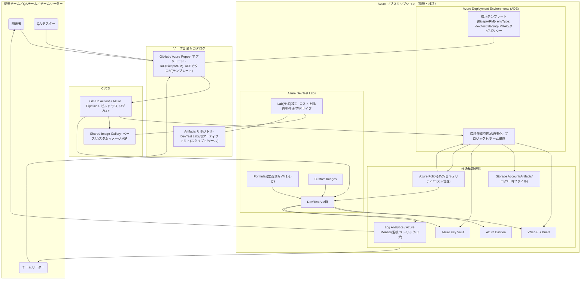
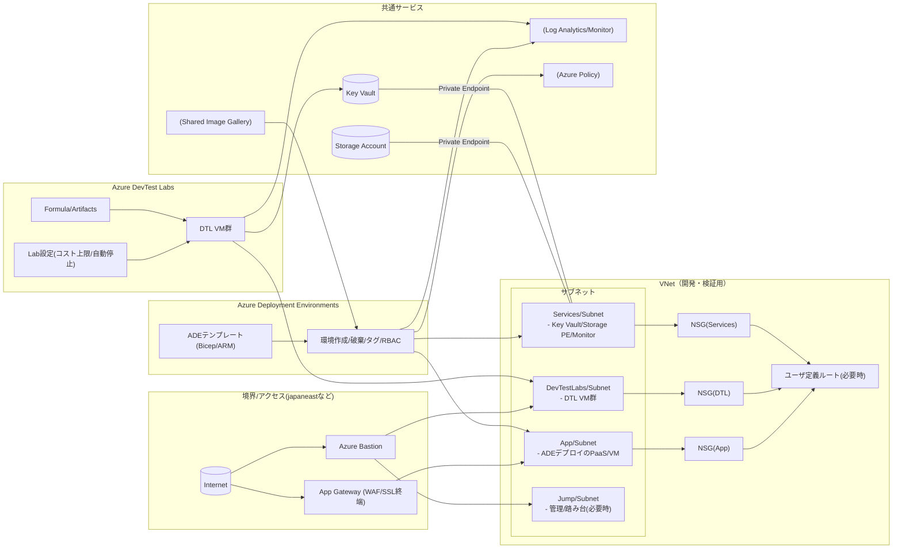

## やりたいこと
### 開発・検証ワークフローの近代化をしたい
AIではなく、AI以前の開発ワークフローに追いつきたい。
MCP活用した支援や「仕様書ベース開発」は、AI以前のワークフローの延長にあると思われるため、
まずはAI以前に追いつくことが大事。

今時の開発環境は以下のものが必要
- ハードウェア(PC等)
- 開発ツール(VSCode, plugins)
- 規約とそれを強制するツール・環境
- デプロイまでのワークフロールールとそれを強制するツール・環境

つまり、単なるハード、ソフトウェアツールのみならず、規約とそれを
強制する環境も用意する必要がある。
そしてそれらを実現するためのサービスがAzureには用意されている（しかも複数）。

以下のサービスのうちDevTest Labsをテストしたい。本来はほしい機能と各サービスの機能・費用比較で
決定するべきだが、それぞれ膨大な機能を持つサービスであり、それぞれが関連するほかのサービスへの
依存も持っているため、全貌がよくわからない。
また、終了予定のAzure Labの後継DevBoxですらWindows 265へ吸収されるなど、サービスの整理も盛んであるため、
調査もむつかしい。

#### DevTest Labs
開発・テストのためのラボで、ARMやADEを使ってAtricactを適用させた仮想PCや、サービスの集合体である
環境自体を提供できる模様。
また、ユーザ管理(EntraIDユーザ以外も可能)もこの中で可能(Microsoftアカウントが必要)。
#### Windows 365
フル機能のクラウドPCで、チームやエンタープライズのルールを強制できる。
#### DevBox
DeBoxはWindows 365に吸収予定。

## ワークフロー全体像
ADEは、プロジェクトや環境タイプ（dev/test 等）ごとにテンプレートからリソースを一括作成し、タグ/RBAC/ポリシーでガバナンスを利かせます。
DevTest Labsは、開発者がセルフサービスでVM を迅速に払い出しできる仕組み。コスト制御（自動停止、サイズ制限）やアーティファクトで初期構成自動化。
Shared Image Galleryでベース/カスタムイメージを共有し、ADE の VM/Scale SetやDevTest Labs の VMで共用できます。
**監視/ログ（Log Analytics/Azure Monitor）とセキュリティ（Key Vault, Policy）**は共通化して、プロジェクト横断の標準運用に寄せます。

Private Endpointで Storage/Key Vault へのアクセスを VNet 内に閉じ、NSG/UDR で東西/南北トラフィックを制御。
Bastionを使うことで、RDP/SSH を公開せず安全に VM へアクセス。
Azure Policyでサブスクリプション横断のタグ付与、許可リージョン/SKU、不要な公開 IP 禁止などを一括適用。
Log Analytics/Azure Monitorで VM/サービスのメトリック・ログを収集し、アラート/ダッシュボードを標準化。

ガバナンス統一：ADE テンプレートに「タグ（CostCenter/Owner/Project）」「RBAC ロール」「ポリシー割り当て」を組み込み、環境作成＝標準適用の形にします。
コスト最適化：DevTest Labs のスケジュール自動停止と許可 VM サイズで無駄を抑制。ADE でも Auto-shutdown をリソースに適用。
初期構成自動化：Artifacts を使い、VM 作成時にエージェント導入（Monitor/Defender）やツール配布を自動化。
イメージ戦略：Shared Image Gallery にOS パッチ済み・ミドルウェア同梱イメージを置き、ADE/DTL のどちらからも参照。
ネットワーク分離：App/Subnet と DTL/Subnet を分離し、NSG と UDR でテスト用 VM の影響がアプリ側に波及しないように。

